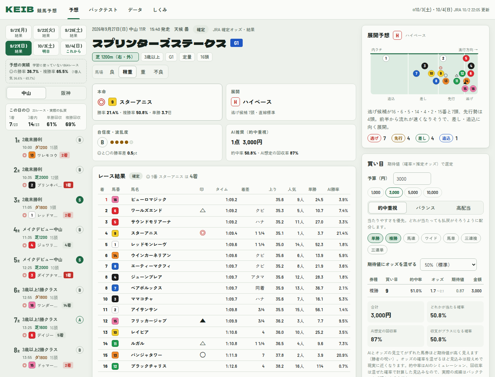

# KEIB 競馬予想

JRA の**実際の出馬表・オッズ・結果**で予想する競馬予想ソフトです。前4走の馬柱からスピード指数・展開・適性などを数値にし、レースを何万回もシミュレーションして各馬の勝率を出し、オッズと比べて期待値の高い買い目を提案します。**架空のデータは一切使いません。**

- **過去・今日・これから**のレースを開催日ごとに表示。発走までの時間、締切間近・結果待ちの状態を表示します
- **確定したレースは答え合わせ**：着順・払戻と、予想（◎や推奨買い目）が実際にいくら戻ったかを並べて表示
- **リアルタイム更新**：`npm run server` で、出馬表・オッズは発走が近いほど短い間隔（2〜30分）で、結果と払戻は発走10分後から自動で取り込みます
- 基準タイム・馬場差・騎手/厩舎成績・枠順傾向・予想の重みは、**すべて実際のレース結果から計算**しています



> 予想は参考情報であり、的中や利益を保証しません。オッズは取得した時点の値です。馬券の購入前に必ず JRA 公式の情報を確認してください。馬券の購入は20歳から。

開発の経過・いま行っている作業・引き継ぎ事項は、このページの最後の[開発日記（引き継ぎ資料）](#開発日記引き継ぎ資料)にまとめています。

## できること

| 画面 | 内容 |
| --- | --- |
| 予想 | 開催日（結果・今日・明日・これから）→ 競馬場 → レース。出馬表に印（◎○▲△☆）・AI指数・勝率・複勝率・期待値。行を開くと馬柱（前4走）、評価の内訳、着順分布 |
| 結果 | 確定したレースは着順・タイム・上がり・払戻と、◎の着順・推奨買い目の実際の払戻を表示。開催日ごとに◎の成績（1着・3着内・単勝/複勝回収率） |
| 展開予想 | 通過順から脚質を推定し、逃げ・先行馬の数からペース（H/M/S）を予想。隊列図つき |
| 買い目 | 予算と戦略（的中重視・バランス・高配当）から、7券種（単勝〜三連単）の買い目と金額を提案。オッズ発表前は勝率だけ表示 |
| 重み付け | 10項目（スピード指数・近走・上がり・騎手・厩舎・適性・展開・枠順・状態・人気）。プリセット「総合」「AI単独」など |
| バックテスト | 学習に使っていない実際のレースでの的中率・回収率（実際の払戻）・累積収支・確率の当たり具合。直近の開催日を今の設定で検証することもできます |
| データ | 実データの更新状況。自分で用意した出馬表・過去走の CSV / JSON の取り込み |

## 使い方

### リアルタイム版（自分の PC で動かす）

```bash
npm install
npm run server     # http://localhost:8080
```

起動すると JRA 公式サイトから今週の出馬表・オッズと、発走後のレースの結果を取り込み、1分ごとに更新を確認します。画面も1分ごとに最新のデータを読み直します。JRA へのアクセスは 1.2 秒に 1 回までで、変わらないページはキャッシュします。

スマホなど外から見るときは、[cloudflared](https://developers.cloudflare.com/cloudflare-one/connections/connect-networks/downloads/) を入れて `npm run tunnel` を実行し、表示される `https://xxxx.trycloudflare.com` を開きます（URL を知っている人は誰でも見られるので、自分だけで使ってください）。

### 過去の結果を集める・モデルを校正する

```bash
npm run collect -- history 2025-10 2026-09   # 指定した月の全レース結果と確定オッズを data/history に保存（1年分で約2時間）
npm run calibrate                            # 統計（基準タイム・馬場差・騎手/厩舎・枠順）と予想の重みを推定
npm run evaluate                             # 学習に使っていない直近のレースで検証（src/data/realBacktest.js を更新）
npm run build-data                           # 画面用の実データ data/bundle.json を作る（過去の開催日＋今週）
npm run build                                # dist/ を作る（data/bundle.json があれば dist/data.json にコピー）
```

集めたデータ（`data/`）はリポジトリに含めません。

### claude.ai の Artifact

`dist/artifact.html` と実データ `dist/data.json` を claude.ai の非公開 Artifact として公開しています：<https://claude.ai/artifact/SEpXBGjVE5ftK8aWq191x4>（持ち主と共有した人だけが開けます）

開催日（土日）は 9:07・12:07・15:07・20:07（日本時間）に、Claude Code のルーティン「KEIB 実データ更新（土日の開催日）」が JRA から最新の出馬表・オッズ・結果を取り込んで公開し直します。止めるときは claude.ai の Routines（ルーティン）の一覧から無効にするか削除してください。Artifact はブラウザの外と通信できないため、本当のリアルタイム（1分ごと）は `npm run server` を使ってください。

## 予想のしくみ

1. **スピード指数**：走破タイムを基準タイムと比べて数値化。基準タイムは実際のレース結果から、競馬場×芝ダート×距離ごとの「2勝クラス・良馬場の勝ち時計」を、馬場状態の差・クラスの差と同時に推定します。さらに開催日ごとの**馬場差**（その日の勝ち時計のずれ）で補正します。80 が2勝クラスの勝ち馬の水準。
   `指数 = 80 + 1000 ×（基準タイム − 走破タイム）÷ 基準タイム + 2 ×（斤量 − 55）`
2. **ファクター**：近走の着順・着差・クラス、上がり3F（同じ条件の中央値との差）、騎手と厩舎の成績（実データ）、距離・コース・馬場・芝ダ・回りの適性、展開（脚質×ペース×直線の長さ）、枠順（コース別の実際の傾向）、状態（休み明け・叩き2戦目・斤量増減・馬体重増減・年齢）、人気。
3. **重みの推定**：各ファクターをレース内で標準化し、実際のレースで1〜3着の順番を最もよく説明する重みを推定します（プラケット・ルース尤度）。学習では各レースの時点で手に入る情報だけを使います。「総合」はAIのファクターと単勝オッズを同時に当てはめた重み、「AI単独」はオッズを使わない重みです。
4. **モンテカルロ・シミュレーション**：「能力スコア＋揺らぎ」で既定2万回レースを走らせ、勝率・連対率・複勝率と全券種の組み合わせ確率を集計します。
5. **期待値**：`期待値 = 的中確率 × オッズ`。単勝以外のオッズは単勝オッズから推定します。AIとオッズの見立てがずれた馬券ほど期待値が高く見える「勝者の呪い」を抑えるため、期待値の計算にはオッズの確率を混ぜます（標準50%）。

## 検証結果（実際のレース）

<!-- results -->
学習に使っていない期間（2026-07-04〜2026-09-27、平地 864レース）での結果です。各レースの予想はそのレースより前の情報だけで計算し、統計は 2025-10〜2026-02、重みは 2026-03〜06 のレースで推定しています。払戻は実際の金額、1点100円（`npm run evaluate`）。

| | ◎の勝率 | ◎の複勝率 | 勝ち馬の対数損失（小さいほど良い） |
| --- | --- | --- | --- |
| 総合（AI＋人気・既定） | 36.7% | 65.5% | 1.887 |
| AI単独（オッズを使わない） | 30.2% | 58.0% | 2.121 |
| 1番人気（単勝オッズ） | 36.6% | 65.7% | 1.888 |

| 買い方（総合） | 購入点数 | 的中率 | 回収率 |
| --- | --- | --- | --- |
| AI推奨（的中重視・単勝/複勝・1レース1,000円） | 1,195 | 56.4% | 89.9% |
| 単勝 ◎ | 864 | 36.7% | 85.7% |
| 複勝 ◎ | 864 | 64.8% | 84.7% |
| 馬連 ◎-○ | 864 | 18.3% | 93.0% |
| ワイド ◎-○▲ | 1,662 | 27.6% | 81.2% |
| 三連複 ◎軸 相手4頭 | 5,175 | 4.8% | 71.6% |
| 1番人気の単勝（比較用） | 864 | 36.6% | 86.1% |

- 予測した勝率と実際の勝率はよく一致しています（例：予測 20〜30% の馬は実際 24.1%、30〜45% は 36.3%）。
- 「総合」は単勝オッズとほぼ同じ精度で、わずかに上回ります。データだけの「AI単独」はオッズに届きません。
- 期待値で選ぶ買い方は、オッズが実際にわかる単勝・複勝なら見込みと実際がほぼ一致しました（的中重視・単複：見込み 約87% → 実際 89.9%）。馬連〜三連単はオッズを推定するしかなく、期待値で選ぶと実際の払戻が見込みを大きく下回った（見込み 112% → 実際 43%）ため、初期状態では使いません。
<!-- /results -->

オッズには多くの人の予想がすでに織り込まれているため、長期的に回収率100%を超えるのは非常に難しく、ここでも多くの買い方が100%を下回ります。過去の成績は将来の結果を保証しません。

## データについて

- 出馬表・オッズ・結果・払戻は JRA 公式サイト（www.jra.go.jp）の公開情報を、個人の分析用に取得しています。取得は 1.2 秒に 1 回までに抑え、変わらないページはキャッシュします。
- 集めたデータ（`data/`）や画面用データ（`dist/data.json`）は、不特定多数が見られる場所に置かないでください。GitHub Pages など公開の場所には実データを含めていません。
- 地方・海外のレースは馬場が違うため、スピード指数を計算しません。障害レースは予想の対象外です。

## 自分のデータで予想する

「データ」画面でレース情報を入れ、自分で用意した出馬表と過去走の CSV を貼り付ける（またはファイルを選ぶ）と予想できます。「列名を入れる」で1行目の形式が入ります。

```csv
枠,馬番,馬名,性齢,斤量,騎手,馬体重,増減,単勝オッズ,父,騎手勝率,騎手複勝率
```

```csv
馬番,日付,競馬場,レース名,クラス,芝ダ,距離,馬場,頭数,着順,タイム,着差,上がり3F,上がり順位,通過順,斤量,騎手
```

## 開発

```bash
npm test            # ユニットテスト（node:test）
npm run dev         # 変更を監視して自動ビルド
npm run experiment  # 特徴量の組み合わせを、学習に使っていないレースで比較（開発用）
```

```
src/
  collector/   JRA公式サイトの取得・解析、画面用データ（バンドル）の組み立て
  data/        実データから統計とレース前時点の出馬表を作る処理、検証結果
  engine/      予想エンジン（指数・ファクター・モデル・シミュレーション・市場・買い目・バックテスト）
  ui/          画面（レース一覧・予想・結果・バックテスト・データ・しくみ）とグラフ
  main.js      アプリ本体（実データの読み込み・自動更新・状態・イベント）
scripts/       収集・校正・検証・特徴量の実験・データ作成・ビルド・リアルタイムサーバー・Cloudflare Tunnel
test/          テスト（入力は手で書いた最小限のデータ）
```

## 開発日記（引き継ぎ資料）

このプロジェクトで行ってきた開発の経過、判断の理由、つまずいた点、次にやることを時系列で記録しています。次に開発する人はまずここを読んでください。作業が進むたびに更新します。

### いまの状況

<!-- status -->
**2026-10-02 22:05 JST 更新**

- **完了**：1年分（2025-10-04〜2026-09-27、3,450レース）の収集、実データでの校正（統計・重み・着順ごとの温度）、学習に使っていない 7〜9月 864レースでの検証（上の「検証結果」）、Artifact の公開し直し（実データ版、Version 2）、土日の自動更新ルーティンの作成。
- **作業中**：ルーティンを手動で1回動かして、自動更新が最後まで通るかを確認している。
- **次にやること（候補）**：
  1. 祝日の月曜開催への対応（ルーティンの日程）
  2. 予想の精度：オッズにない情報（調教・血統など）を JRA 公式から取れる範囲で検討。今のファクターの追加候補は効果がなかった（日記の 21:45 の項）
<!-- /status -->

### 全体の構成（データの流れ）

```
JRA公式サイト（www.jra.go.jp/JRADB）
  │  src/collector：POST（cname=…）・Shift_JIS・1.2秒間隔・キャッシュ・503 は再試行
  ▼
data/history/{年}/{レースID}.json … 過去の結果＋確定オッズ（学習・検証・過去の開催日の表示に使う）
  │
  ├─ scripts/calibrate.mjs ─▶ src/engine/realStats.js（基準タイム・馬場差・騎手/厩舎・枠順）
  │                          src/engine/calibration.js（ファクターの重み・揺らぎ）
  ├─ scripts/evaluate.mjs  ─▶ src/data/realBacktest.js（学習に使っていない期間の検証結果）
  │
  └─ scripts/build-data.mjs / scripts/server.mjs
        │ 直近4開催日（結果つき）＋今週の出馬表・オッズ（発走後は結果も）
        ▼
     data/bundle.json → dist/data.json（ビルド時に HTML にも埋め込む）
        ▼
     画面（src/main.js）：data.json を読み、ブラウザの中で予想（src/engine）
```

### 日記

#### 2026-10-02 18:40 JST 最初の版（コミット 6848ffd・b2027b8）

- 依頼：「競馬の予想ソフトを作り、Cloudflare Tunnel などで公開して見られるように」
- ブラウザだけで動く1ファイルの予想ソフトを作成（esbuild）。エンジンはスピード指数・9ファクター・プラケット・ルース尤度での重み推定・モンテカルロ・単勝オッズからの市場モデル・期待値・買い目の配分・バックテスト。画面は出馬表・展開・買い目・重み付け・バックテスト・CSV 取り込み・しくみ。
- この時点のデータは架空（生成器で作った馬とレース）。
- 公開は claude.ai の Artifact（非公開）。Cloudflare Tunnel はこの作業環境（クラウドのコンテナ）からは使えない（プロキシで 443 以外や証明書固定の通信が通らない）ので、利用者の PC で動かす `npm run tunnel` を用意。GitHub Pages のワークフローも用意。

#### 2026-10-02 19:00 JST 方針変更：実データだけで予想・リアルタイム表示・精度向上

- 依頼：「架空データは絶対に使わず、実際のデータで予想。過去・現在・これからのレースをリアルタイムで表示。信用度と精度を上げる」
- データ源の調査：
  - netkeiba は利用規約で、取得したデータを不特定多数が見られる状態にすることが禁止されている → 使わない。
  - JRA 公式（`www.jra.go.jp/JRADB`）は robots.txt で全許可。ページは `doAction(url, cname)` による POST（本文 `cname=…`、Shift_JIS）。CNAME の末尾2桁はチェックサムなので自分で組み立てず、一覧ページのリンクをたどる。月別の過去結果ページのチェックサムは年月選択ページの `objParam["YYMM"]="XX"` から取る。GET（`?CNAME=`）は一覧・オッズのページで 301 になるので、すべて POST にした。
  - → JRA を採用。集めたデータ（`data/`）はリポジトリに入れない。Artifact は非公開のまま。GitHub Pages には実データを載せない。
- 収集器（`src/collector`）：`jra.js`（出馬表・結果・払戻・オッズ・各種一覧の解析）、`client.js`（順番待ち・最小間隔・429/5xx の再試行・ディスクとメモリのキャッシュ）、`collect.js`（一覧→レース→ページの取得とアプリ用の形への整形）。
- 1年分の収集を開始（19:37 JST〜、約2時間・約3,450レース＋確定オッズ）。

#### 2026-10-02 20:15 JST 画面を実データのタイムラインに作り替え（コミット 708d6b3）

- 架空データの生成器（`src/data/generator.js`・`names.js`）とそのテストを削除。データがないときは予想せず「実データがありません」と案内だけ出す。
- `scripts/build-data.mjs`（画面用バンドル）と `scripts/server.mjs`（リアルタイム版）を作成。出馬表・オッズは発走が近いほど短い間隔で取り直す（3時間超:30分、1〜3時間:10分、1時間以内:2分、発走後に1回）。結果は発走10分後から取りにいく。
- 画面：開催日（結果・今日・明日・これから）→ 競馬場 → レース。状態（発売中・締切間近・結果待ち・確定）と発走までの時間を表示。確定したレースは着順・払戻・予想の答え合わせ（実際の払戻で精算）。開催日ごとの◎の成績。
- 精度向上の仕込み：スピード指数に開催日ごとの馬場差、厩舎の成績ファクター、地方・海外の走は指数を出さない、オッズ発表前は買い目を出さない、障害レースは対象外。
- 校正スクリプトを実データ用に：「総合」（AI のファクターと単勝オッズを同時に推定）と「AI単独」の2つの重み。係数がマイナスになるファクターは外して当てはめ直す。
- テスト：JRA のページ構造をまねて手で書いた最小限の HTML で解析を確認（実際のページの写しはリポジトリに入れない）。

#### 2026-10-02 20:17〜20:30 JST 修正と確認（コミット b08c27f・bf4fb27）

- CI が失敗：`.gitignore` の `data/` が `src/data/` まで無視していた → `/data/` に修正。
- 当日の結果ページは確定直後に変わることがあるので5分だけキャッシュし、払戻が出そろってから取り込むようにした。
- `data.json` を読めない環境（HTML を直接開いた場合など）でも表示できるよう、ビルド時に実データを HTML に埋め込む。
- 先週日曜（9/27）の中山を「出馬表だけ」の状態にして結果の取り込みまで通し、払戻が公式と一致することを確認（スプリンターズS の三連単 462,120円 など）。
- 時計を進めた状態（レース当日の昼）で画面を確認：次に発走するレースを自動で表示し、締切3分前は「締切間近」になる。

#### 2026-10-02 21:00 JST 開発日記を追加

- 依頼：「開発の経過と現在の作業を開発日記として README に書き、逐次更新する。次の開発者への引き継ぎ資料にする」→ この節を追加。
- 特徴量の比較スクリプト（`scripts/experiment.mjs`、`npm run experiment`）を開発用ツールとして追加。

#### 2026-10-02 21:10 JST 途中経過の実験：オッズはとても強い

- 収集済みの2〜9月で、統計：2〜4月、重みの学習：5〜7月（860レース）、検証：8〜9月（584レース）として `scripts/experiment.mjs` で比較（数値は検証期間の勝ち馬の対数尤度、大きいほど良い。同じ頭数でランダムに選ぶと約 −2.6）。

  | モデル | 対数尤度 | 最上位の馬が勝った割合 |
  | --- | --- | --- |
  | 人気（単勝オッズ）のみ | −1.920 | 36.3% |
  | AI単独（9ファクター） | −2.189 | 27.7% |
  | AI＋人気 | −1.923 | 35.8% |

- 分かったこと：
  - AI単独にも予測力はある（ランダムよりずっと良い）が、オッズには届かない。
  - AI＋人気はオッズのみとほぼ同じで、検証期間では上回れなかった。AI 側の係数を0に寄せる正則化（LAMBDA）を強めても、オッズのみに近づくだけ。
  - 候補の特徴量：過去走の人気（ppop）と同じ芝ダでの最高スピード指数（smax）は AI単独を少し改善（−2.189 → −2.176）。複勝オッズ（mplace）は勝ち馬の予測には効かなかった。
  - 単勝オッズの確率そのままが勝ち馬の予測ではほぼ最適（オッズの確率を β 乗して比べると β=1.05 付近が最良で、人気薄の過大評価は小さい）。重みの学習は1〜3着を使うため人気の係数が 0.88 と小さめに出る → 画面の勝率はシミュレーションの揺らぎの大きさで合わせている。
- 方針：全期間のデータで同じ比較をやり直してから決める。精度の面では「総合（AI＋人気）」が上限で、AI単独は「オッズと違う見方」として残す。

#### 2026-10-02 21:20 JST 改善：スピード指数・短評・複勝オッズ

- スピード指数ファクターを「近い条件を重く見た平均」から「同じ芝ダでの最高値（持ち時計）」に変更。検証期間（8〜9月）の AI単独の対数尤度が −2.189 → −2.177 に改善。
- 同じ比較で、AI＋人気は勝ち馬の予測ではオッズのみと同等（−1.919 対 −1.920）、2・3着の予測では少し良い（−4.117 対 −4.127）。馬連・ワイド・三連複などの確率は、オッズだけから作るより少し良くなる。
- 開催日ごとの馬場差は、学習期間では当てはまりが良くなるが、検証期間ではわずかに悪い（−2.177 対 −2.174）。統計に使える期間が短い（2〜4月）ためかもしれないので、全期間のデータで再確認する。
- 短評（強み・不安）は「AI単独」の重みで作るように変更（総合では人気の寄与が大きく、理由が見えにくいため）。
- 複勝：JRA の実際の複勝オッズ（下限〜上限）があれば、下限で期待値を計算。過去の開催日は確定オッズ、当日は発走2時間前から単勝・複勝のオッズのページも取得する。
- スマホでは、横に並ぶレース一覧を選んだレースの位置まで自動で動かす。

#### 2026-10-02 21:45 JST 1年分の収集完了 → 校正と検証（実データ）

- 収集完了：2025-10-04〜2026-09-27 の全 3,450レース（288開催日×12R）と確定オッズ。失敗 0件（JRA の 503 は再試行で回復）、通信 7,236回、約2時間5分。
- 特徴量の比較（統計：〜2月、学習：3〜6月 1,131レース、検証：7〜9月 864レース）：
  - AI＋人気（−1.8909）がオッズのみ（−1.8964）を勝ち馬・2〜3着ともわずかに上回った。
  - 開催日ごとの馬場差は全期間では効果あり（AI単独 −2.1338 → −2.1302）→ 採用。
  - 乗り替わり・過去走の人気・複勝オッズは、総合モデルを改善しなかった → 採用しない。
  - 展開ファクターは係数がマイナスになる（校正ではマイナスの係数を外すので、実質使っていない）。
- 校正の結果（`src/engine/calibration.js`）：AI単独の重要度は近走35・スピード25・騎手15・厩舎10・その他各5。総合の重みは人気94・スピード7・状態4・上がり3など。

#### 2026-10-02 21:50 JST 改善：シミュレーションを推定したモデルと同じ形に

- 最初の検証で、確率が平らすぎる（本命を低く、中位を高く見積もる：予測 35.6% → 実際 40.8%）問題が見つかった。原因は、重みはプラケット・ルース（多項ロジット）で推定しているのに、シミュレーションは「正規分布の揺らぎ＋馬ごとの不確かさ」で走らせていたこと。
- シミュレーションをプラケット・ルースそのものに変更（1着から順に exp(スコア/温度) に比例して引く）。着順ごとの温度も実データで推定（総合：1着 0.90・2着 1.06・3着以下 1.16。2着・3着ほど紛れる）。
- 結果：勝ち馬の対数損失 1.907 → 1.887（オッズは 1.888）、キャリブレーションもほぼ一致（予測 36.0% → 実際 36.3%）。

#### 2026-10-02 21:55 JST 改善：推奨買い目を「見込みどおりに戻る」ものに

- 検証で、期待値で選ぶ「AI推奨（バランス）」は見込み回収率 112% に対して実際 43% と大きく外れた。原因は馬連〜三連単の「推定オッズ」：単勝オッズから組み合わせのオッズを推定するしかなく、人気薄の組み合わせほど実際の配当が見込みより低い。
- 市場の組み合わせ確率も予想と同じ形（人気だけで推定したプラケット・ルース）で作るように変更し、構造の違いだけで「期待値が高く見える」ことはなくした。それでも推定オッズの券種は見込みどおりに戻らなかった。
- 既定の買い方を「的中重視 × 単勝・複勝」に変更（検証で見込み約87%・実際 89.9%、1番人気の単勝 86.1% より良い）。馬連〜三連単を選んだときは「推定オッズなので参考程度に」と表示する。
- 複勝は JRA の実際のオッズ（下限）で期待値を計算（過去は確定オッズ、当日は発走2時間前から取得）。

#### 2026-10-02 22:00 JST Artifact を実データ版で公開し直し、自動更新を設定

- Artifact（https://claude.ai/artifact/SEpXBGjVE5ftK8aWq191x4）を Version 2 として公開。ページ（実データを埋め込み済み）と `data.json` の2ファイル。
- ルーティン「KEIB 実データ更新（土日の開催日）」（`trig_01CVLwcTdR1ieZxhbXh2H3Gj`）を作成：毎週土日の 9:07・12:07・15:07・20:07（日本時間）。毎回新しいセッションで、リポジトリを用意 → Artifact の `data.json` を読む → `build-data --previous` → `npm run build` → 公開し直す。通知はオフ。
  - 9:07 は第1レースの前、15:07 はメインレースの前、20:07 は全レースの結果と翌日の前日オッズ。
  - 祝日の月曜開催は対象外（月曜の結果は次の週末に取り込まれる）。
- 画面用データは使わない項目（過去走のレースID・馬番・状態・馬体重・勝ち馬名）を落として 2.4MB → 2.0MB。

### 判断の記録（なぜそうしたか）

- **予想は単勝オッズにかなり近くなる**：オッズには多くの人の情報が織り込まれていて、データだけの AI より市場のほうがよく当たる。そこで「総合」では AI のファクターとオッズを同時に当てはめ、オッズにまだない情報だけを AI 側の重みとして残す（Benter 型の2段階モデルと同じ考え方）。期待値の計算ではさらにオッズの確率を50%混ぜ、AI とオッズのずれを過大評価しない（勝者の呪い対策）。
- **未来の情報を混ぜない**：学習・検証では、統計（基準タイム・騎手成績など）を学習期間より前のデータだけで作り、各レースの出馬表もそのレースより前の走だけで組み立てる（`preRaceCard`）。開催日ごとの馬場差はその日の結果だけで決まるので全期間で計算してよい（予想するレースより前の日の値しか使われない）。
- **前4走にそろえる**：JRA の出馬表に載るのが前4走なので、学習も4走にそろえている。
- **シミュレーションは推定したモデルと同じ形で**：重みはプラケット・ルースで推定しているので、シミュレーションも同じモデルで引く（正規分布の揺らぎだと確率がずれた）。着順ごとの温度も実データで推定する。
- **推定オッズで期待値を信じない**：オッズが実際にわかる単勝・複勝だけを既定の買い目にする。馬連〜三連単の推定オッズは、人気薄ほど実際の配当より高く出てしまう。
- **Artifact は外部と通信できない**：JRA を直接読めないので、`data.json` を一緒に公開し、開催日に定期的に作り直して公開し直す。本当のリアルタイムは利用者の PC の `npm run server`。

### つまずいた点（同じところで迷わないために）

- 全角→半角の変換（z2h）で「：」「（）」も半角になるので、正規表現は `[:：]` や半角の括弧で書く（父・母の父の名前の取り出し）。
- JRA はときどき HTTP 503 を返す → 3秒・6秒・12秒の間隔で再試行。
- `node --test` は `test/` 以下のファイルをすべてテストとして読むので、`node --test "test/*.test.mjs"` にしている（`test/fixtures` を外すため）。
- 作業環境（Claude Code のクラウド）の Bash では前面の `sleep` が使えない → 長い処理はバックグラウンドで動かし、終了通知を待つ。
- 日曜のレースのオッズは土曜の前日発売まで出ない（出馬表は木曜ごろに出る）→ その間は勝率だけ表示し、買い目は出さない。
- 地方・海外の過去走（大井・香港など）はタイムを比べられないのでスピード指数を出さない。

### 次の開発者へのメモ（やり残し・アイデア）

- 血統（父）の適性：出馬表には父の名前があるが、学習に使う結果ページにはない（馬のページを1頭ずつ取る必要がある）ので、今は使っていない。
- 祝日の月曜開催：自動更新は土日だけの予定なので、月曜の結果は次の週末に取り込まれる。
- 候補の特徴量：乗り替わり（jchg）・過去走の人気（ppop）・スピード指数の最高値と前走（smax・slast）。`npm run experiment` で比べてから本体に入れる。
- 公開してはいけないもの：`data/`、`dist/data.json`、実データを埋め込んだ `dist/*.html`（Artifact は非公開で共有する）。

